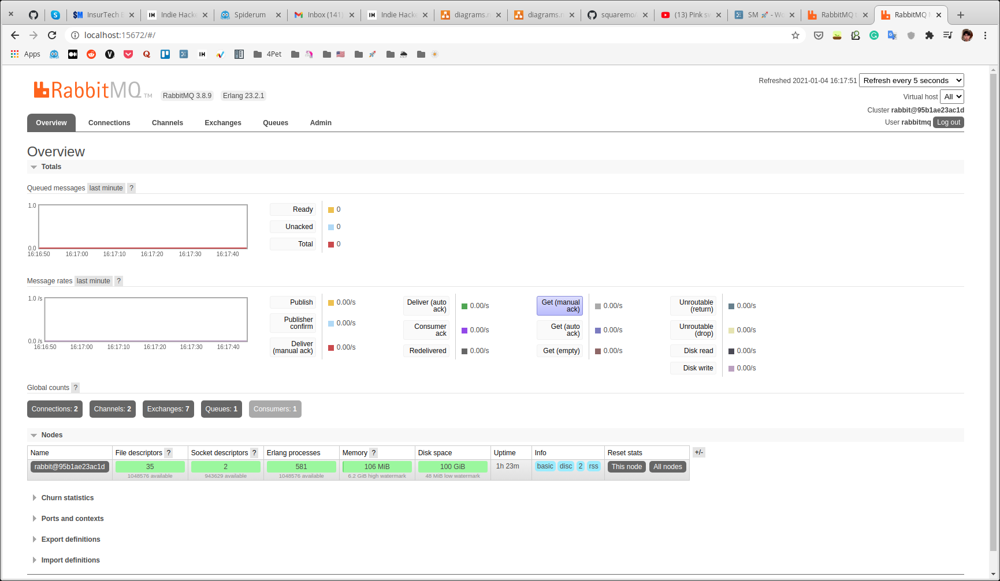

# rabbitmq-socket

Building a realtime application with RabbitMQ 🐰 and Socket 🦊.

- Start RabbitMQ & API service

```shell
cd server && yarn
cd ../client && yarn
docker-compose up -d --build
```

- Go to http://localhost:15672/


